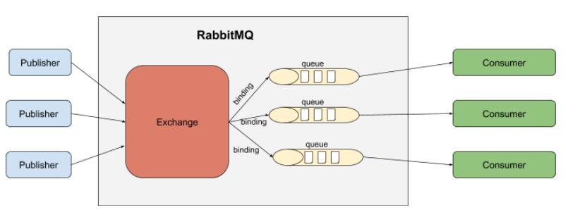
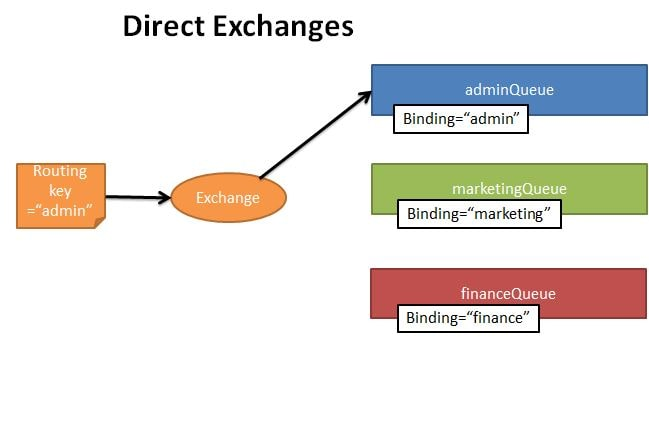
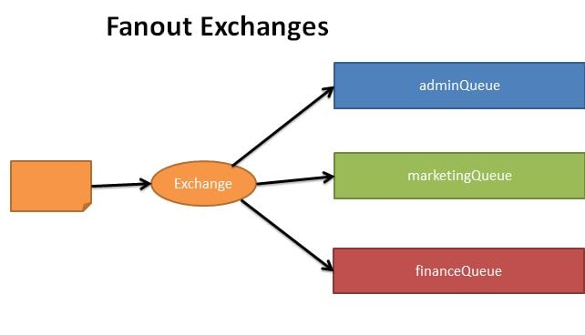
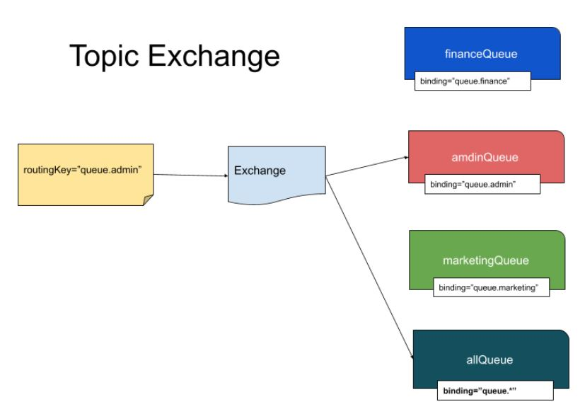
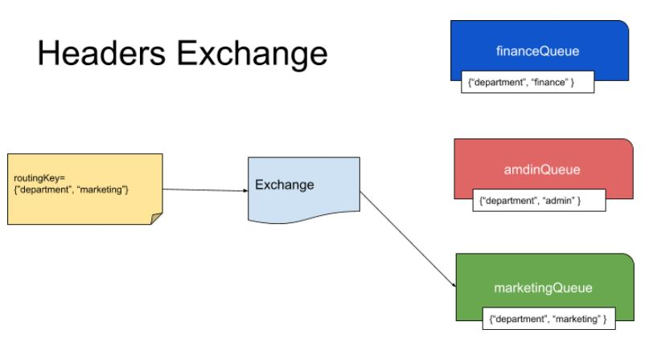

# Introduction:

This project is about to demonstrate using RabbitMQ with Springboot technologies.

RabbitMQ : https://www.rabbitmq.com/
Springboot : https://spring.io


When using RabbitMQ the publisher never directly sends a message to a queue. Instead, the publisher sends messages to an exchange. Exchange is responsible for sending the message to an appropriate queue based on routing keys, bindings and header attributes. Exchanges are message routing agents which we can define and bindings are what connects the exchanges to queues. So in all our examples we will be creating first a Queue and Exchange, then bind them together.



With RabbitMQ we have the following types of Exchanges-
- Direct Exchange
- Fanout Exchange
- Topic Exchange
- Header Exchange

REf: https://www.javainuse.com/messaging/rabbitmq/exchange


# Install RabbitMQ with docker

https://www.rabbitmq.com/download.html

````
docker run -it --rm --name rabbitmq -p 5672:5672 -p 15672:15672 rabbitmq:3-management
````
# Direct Message

Based on the routing key a message is sent to the queue having the same routing key specified in the binding rule. The routing key of exchange and the binding queue have to be an exact match. A message is sent to exactly one queue.




````
curl "http://localhost:8080/api/rabbitmq/producer?code=001&description=MyDescription"
````

Example 
- Consumer : see class RabbitMQReciver.java  
- Sender : see class RabbitMQSender.java

# Fanout Exchange
The message is routed to all the available bounded queues. The routing key if provided is completely ignored. So this is a kind of publish-subscribe design pattern.



````
 curl -i "http://localhost:8080/api/rabbitmq/fanout?exchangeName=fanout-exchange&messageData=message`"
````

# Topic Exchange

Here again the routing key is made use of. But unlike in direct exchange type, here the routing key of the exchange and the bound queues should not necessarily be an exact match. Using regular expressions like wildcard we can send the exchange to multiple bound queues.


````
curl "http://localhost:8080/api/rabbitmq/topic?exchangeName=topic-exchange&routingKey=queue.admin&messageData=MessageData"
````

# Header Exchange
In this type of exchange the routing queue is selected based on the criteria specified in the headers instead of the routing key. This is similar to topic exchange type, but here we can specify complex criteria for selecting routing queues



````
curl "http://localhost:8080/api/rabbitmq/header?exchangeName=header-exchange&department=admin&messageData=MessageValue"
````